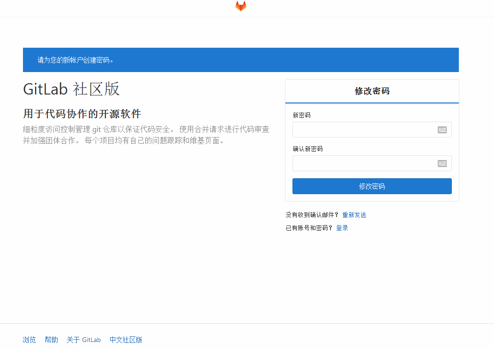

# centos 7 部署  gitlab-10.5.6

## 一、准备好基础环境

### 1、配置好yum，安装基础软件

[root@gitlab ~]# yum -y update

[root@gitlab ~]# yum -y install  wget

[root@gitlab ~]# yum -y install  vim

### 2、安装gitlab的依赖项

[root@gitlab ~]# yum install -y curl openssh-server openssh-clients postfix cronie policycoreutils-python

### 3、启动postfix，并设置为开机启动 

[root@gitlab ~]# systemctl start postfix

[root@gitlab ~]# systemctl enable postfix

### 4、关闭防火墙

[root@gitlab ~]# systemctl stop firewalld

### 5、获取gitlab的rpm包

[root@gitlab ~]# wget https://mirrors.tuna.tsinghua.edu.cn/gitlab-ce/yum/el7/gitlab-ce-10.5.6-ce.0.el7.x86_64.rpm

### 6、安装rpm包

[root@gitlab ~]# rpm -ivh gitlab-ce-10.5.6-ce.0.el7.x86_64.rpm

### 7、根据提示，继续执行指令配置gitlab。 

[root@gitlab ~]# gitlab-ctl reconfigure

### 8、gitlab.rb，改成当前服务器IP以及端口号

[root@gitlab ~]# vim /etc/gitlab/gitlab.rb

### 9、因为修改了配置文件，故需要重新加载配置内容

[root@gitlab ~]# gitlab-ctl reconfigure

[root@gitlab ~]# gitlab-ctl restart

## 二、gitlab汉化

### 1、安装git获取gitlab汉化包

[root@gitlab ~]# yum -y install  git

[root@gitlab ~]# git clone https://gitlab.com/xhang/gitlab.git

### 2、查看该汉化补丁的版本

[root@gitlab ~]# cat gitlab/VERSION

### 3、查看gitlab版本 

[root@gitlab ~]# head -1 /opt/gitlab/version-manifest.txt

### 4、覆盖汉化包

#### 4.1、停止gitlab服务

[root@gitlab ~]# gitlab-ctl stop

#### 4.2、切换到gitlab汉化包所在的目录（即步骤二获取的汉化版gitlab）

[root@gitlab ~]# cd /root/gitlab
 
#### 4.3、比较汉化标签和原标签，导出 patch 用的 diff 文件到/root下 

[root@gitlab ~]# git diff v10.5.6 v10.5.6-zh > ../10.5.6-zh.diff

[root@gitlab ~]# cd ..

[root@gitlab ~]# patch -d /opt/gitlab/embedded/service/gitlab-rails -p1 < 10.5.6-zh.diff

#### 4.4、启动gitlab

[root@gitlab ~]# gitlab-ctl start
 
#### 4.5、重新配置gitlab 

[root@gitlab ~]# gitlab-ctl reconfigure

#### 4.6、登陆验证

登陆（192.168.1.209:9091），管理员账号登录的用户名：root第一次需要修改密码

## 三、gitlab备份、恢复与迁移

### 1、Gitlab备份

使用Gitlab一键安装包安装Gitlab非常简单, 同样的备份恢复与迁移也非常简单. 使用一条命令即可创建完整的Gitlab备份:

[root@gitlab ~]# gitlab-rake gitlab:backup:create

使用以上命令会在/var/opt/gitlab/backups目录下创建一个名称类似为1522222015_2018_03_28_9.2.2_gitlab_backup.tar

这个压缩包就是Gitlab整个的完整部分, 其中开头的1522222015_2018_03_28是备份创建的日期 

#### 1.1、Gitlab备份目录

可以通过/etc/gitlab/gitlab.rb配置文件来修改默认存放备份文件的目录

gitlab_rails['backup_path'] = "/var/opt/gitlab/backups"

/var/opt/gitlab/backups修改为你想存放备份的目录即可, 修改完成之后使用gitlab-ctl reconfigure命令重载配置文件即可。

#### 1.2、Gitlab自动备份

实现每天凌晨2点进行一次自动备份:通过crontab使用备份命令实现

0 2 * * * /opt/gitlab/bin/gitlab-rake gitlab:backup:create

### 2、Gitlab恢复

Gitlab的从备份恢复也非常简单:

#### 2.1、停止相关数据连接服务

[root@gitlab ~]# gitlab-ctl stop unicorn

[root@gitlab ~]# gitlab-ctl stop sidekiq

#### 2.2、从1522222015编号备份中恢复

[root@gitlab ~]# gitlab-rake gitlab:backup:restore BACKUP=1522222015_2018_03_28

#### 2.3、启动Gitlab

[root@gitlab ~]# gitlab-ctl start

### 3、gitlab迁移

所以无非是两种思路，一种将老的gitlab先升级到你要的gitlab版本，再迁移备份；另一种将gitlab安装的版本和老gitlab一致，迁移完成后再进行升级。

实例：先进行升级再迁移

在旧服务器上下载新版本的RPM包

[root@gitlab ~]# wget https://mirrors.tuna.tsinghua.edu.cn/gitlab-ce/yum/el7/gitlab-ce-10.5.6-ce.0.el7.x86_64.rpm

#### 3.1、更新gitlab

关闭部分gitlab服务

[root@gitlab ~]# gitlab-ctl stop unicorn

[root@gitlab ~]# gitlab-ctl stop sidekiq

[root@gitlab ~]# gitlab-ctl stop nginx

#### 3.2、升级

[root@gitlab ~]# rpm -Uvh gitlab-ce-10.0.4-ce.0.el7.x86_64.rpm

#### 3.3、重新配置gitlab

[root@gitlab ~]# gitlab-ctl reconfigure
 
#### 3.4、重启gitlab

[root@gitlab ~]# gitlab-ctl restart
 
#### 3.5、然后再备份

[root@gitlab ~]# gitlab-rake gitlab:backup:create

#### 3.6、gitlab的配置文件（gitlab.rb）是不因备份恢复而恢复的，故要将老的gitlab的配置文件也取过来，否则就需要维护人员重新配置。

获取gitlab.rb

在新服务器上，使用scp命令将老服务器（192.168.1.1）的备份文件复制到/etc/gitlab/目录下。

[root@gitlab ~]# scp  /etc/gitlab/gitlab.rb  root@192.168.1.2:/etc/gitlab/gitlab.rb

获取备份文件 

在新服务器上，使用scp命令将老服务器（192.168.1.1）的备份文件（1508412719_2017_10_19_10.0.2_gitlab_backup.tar）复制到/var/opt/gitlab/backups/目录下。 

scp  /var/opt/gitlab/backups/1522222015_2018_03_28_9.2.2_gitlab_backup.tar   root@192.168.1.2:/var/opt/gitlab/backups/

以新gitlab服务器的ip为192.168.1.209为例，修改gitlab配置文件。 

[root@gitlab ~]# vim /etc/gitlab/gitlab.rb
 
修改external_url，wq保存

external_url 'http://192.168.1.209:9091'

新服务器重新配置gitlab 

[root@gitlab ~]# gitlab-ctl reconfigure

### 4、恢复迁移gitlab数据

#### 4.1、将备份文件的权限改为777，否则恢复的时候会出现权限不够导致解压失败的问题。 
 
[root@gitlab ~]# chmod 777 /var/opt/gitlab/backups/1522222015_2018_03_28_9.2.2_gitlab_backup.tar

#### 4.2、停止相关数据连接服务 

[root@gitlab ~]# gitlab-ctl stop unicorn

[root@gitlab ~]# gitlab-ctl stop sidekiq
 
#### 4.3、恢复gitlab 

使用“gitlab-rake gitlab:backup:restore BACKUP=备份文件编号”指令可以根据备份文件来恢复，因为示例中是使用1522222015_2018_03_28_9.2.2_gitlab_backup.tar来恢复，故备份文件编号为1522222015_2018_03_28_9.2.2

[root@gitlab ~]# gitlab-rake gitlab:backup:restore BACKUP=1522222015_2018_03_28_9.2.2

等待片刻后，由于新的gitlab还是处于初始状态，直接输入“yes”，回车。

然后就是等待恢复的结束。
  
到了下面的内容时，输入“yes”，回车。
