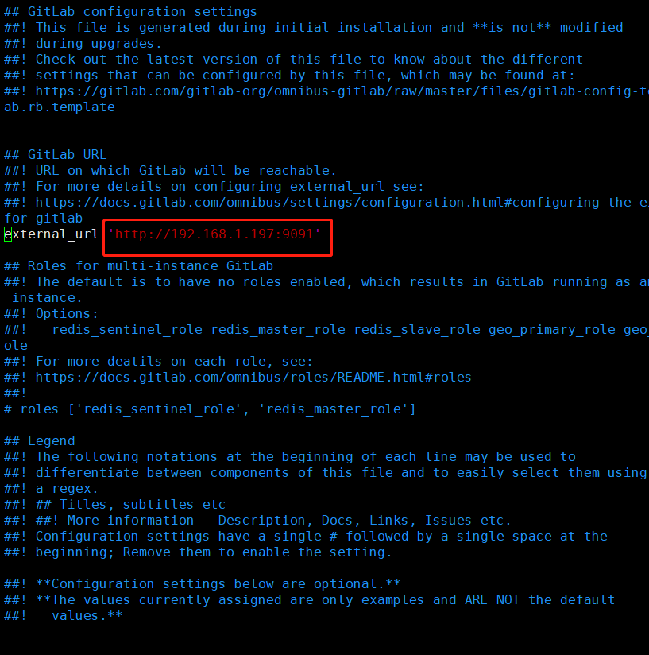

# centos 7 部署  gitlab-10.5.6

## 准备好基础环境

### 1、配置好yum，安装基础软件

[root@gitlab ~]# yum -y update

[root@gitlab ~]# yum -y install  wget

[root@gitlab ~]# yum -y install  vim

### 2、安装gitlab的依赖项

[root@gitlab ~]# yum install -y curl openssh-server openssh-clients postfix cronie policycoreutils-python

### 3、启动postfix，并设置为开机启动 

[root@gitlab ~]# systemctl start postfix

[root@gitlab ~]# systemctl enable postfix

### 4、关闭防火墙

[root@gitlab ~]# systemctl stop firewalld

### 5、获取gitlab的rpm包

[root@gitlab ~]# wget https://mirrors.tuna.tsinghua.edu.cn/gitlab-ce/yum/el7/gitlab-ce-10.5.6-ce.0.el7.x86_64.rpm

### 6、安装rpm包

[root@gitlab ~]# rpm -ivh gitlab-ce-10.5.6-ce.0.el7.x86_64.rpm

### 7、根据提示，继续执行指令配置gitlab。 

[root@gitlab ~]# gitlab-ctl reconfigure

### 8、gitlab.rb，改成当前服务器IP以及端口号

[root@gitlab ~]# vim /etc/gitlab/gitlab.rb

